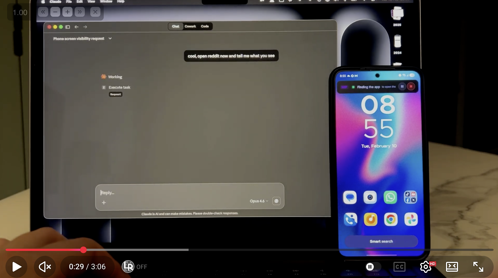
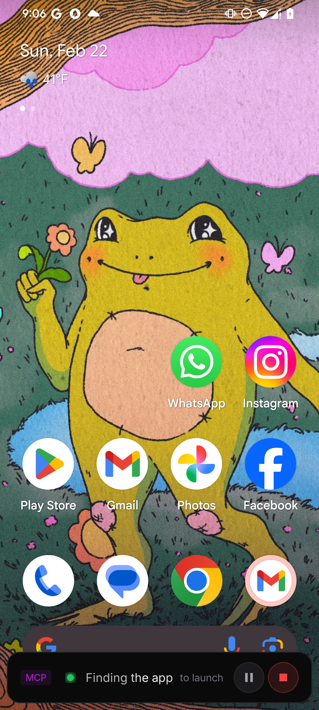
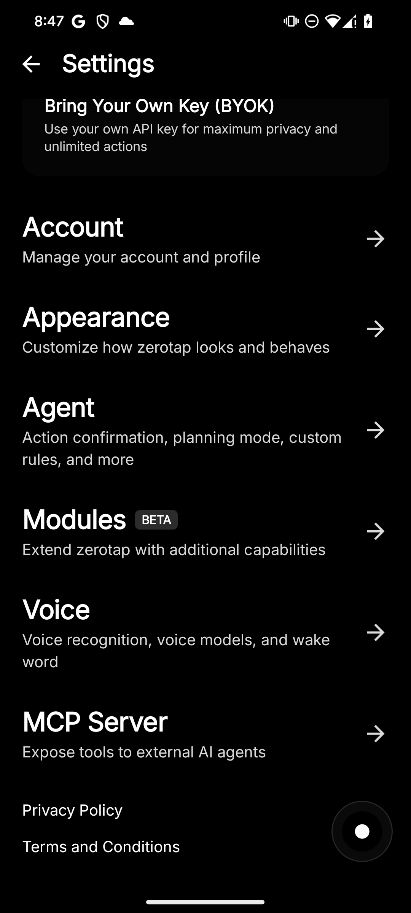

# Android MCP Server

Turn your Android phone into a [Model Context Protocol](https://modelcontextprotocol.io/) server. Control any app from [OpenClaw](https://openclaw.ai), Claude Desktop, Claude Code, Cursor, Cline and other MCP-compatible AI agents.

Powered by [zerotap](https://zerotap.app) — an AI agent that actually controls your Android phone.

**No ADB, no USB, no rooting required.** Just install the app, enable MCP Server in settings, and connect over Wi-Fi.

## See it in action

[](https://www.youtube.com/watch?v=pi_JT3fPQlQ)

<p align="center">
  
</p>

<p align="center">
  <a href="https://play.google.com/store/apps/details?id=com.inscode.zerotap">
    
  </a>
</p>

## What is zerotap?

[zerotap](https://zerotap.app) is a lightweight AI assistant that turns a single plain-language sentence into a real action on your Android phone. No menus to dig through, no syntax to memorize — just type what you want and zerotap does it for you:

- *"Open the camera and take a photo"*
- *"Send a message to Sarah saying I'll be 5 minutes late"*
- *"Open YouTube and find a brownie recipe"*

Under the hood, zerotap reads your request and translates it into taps, swipes and keystrokes using Android Accessibility Service — all executed locally on your device.

## Why an MCP server?

zerotap exposes its capabilities as an MCP server, so any compatible AI agent on your computer can control your phone over Wi-Fi. Your desktop AI thinks, your phone acts.

**Compatible clients:** [OpenClaw](https://openclaw.ai), Claude Desktop, Claude Code, Cline, Cursor, and any MCP-compatible client.

## Available tools

| Tool | Description |
|------|-------------|
| `execute_task` | Delegate a task to the zerotap agent. Describe what you want in natural language and zerotap handles the taps, swipes and typing. |
| `get_screen_state` | Returns the current UI hierarchy of the screen in a structured format. Useful for inspecting what's on screen before taking action. |
| `get_device_status` | Check if the device is ready — screen on, unlocked, accessibility service enabled. Returns a clear status with instructions if something needs attention. |

## Quick start

### 1. Install zerotap & configure AI

Download [zerotap from the Play Store](https://play.google.com/store/apps/details?id=com.inscode.zerotap). Sign in to zerotap Cloud or configure your own API key in BYOK mode.

### 2. Enable MCP Server

Go to **Settings → MCP Server** and flip the switch. Your phone starts an MCP server on the local network.

<p align="center">
  
  
</p>

### 3. Connect your MCP client

Copy the config snippet from the app and paste it into your MCP client.

## Setup guides

### OpenClaw / Claude Desktop

Add to your MCP config:

```json
{
  "mcpServers": {
    "zerotap": {
      "command": "npx",
      "args": [
        "mcp-remote",
        "http://<phone-ip>:8485/mcp",
        "--header",
        "Authorization: Bearer <your-token>",
        "--allow-http"
      ]
    }
  }
}
```

### Claude Code / Cline

```bash
claude mcp add zerotap \
  -- npx mcp-remote \
  http://<phone-ip>:8485/mcp \
  --header "Authorization: Bearer <your-token>" \
  --allow-http
```

### Cursor

Add to your `.cursor/mcp.json`:

```json
{
  "mcpServers": {
    "zerotap": {
      "command": "npx",
      "args": [
        "mcp-remote",
        "http://<phone-ip>:8485/mcp",
        "--header",
        "Authorization: Bearer <your-token>",
        "--allow-http"
      ]
    }
  }
}
```

### Any MCP client

```
Endpoint:  http://<phone-ip>:8485/mcp
Transport: Streamable HTTP (JSON-RPC 2.0)
Auth:      Bearer token (from zerotap app → Settings → MCP Server)
Bridge:    use mcp-remote if your client only supports stdio
```

> **Where to find `<phone-ip>` and `<your-token>`?** Open zerotap → Settings → MCP Server. Both values are displayed there with a copy button.

## Cloud vs BYOK

zerotap works in two modes — both fully supported with the MCP server:

| | Cloud | BYOK |
|---|---|---|
| **Setup** | Sign in and go | Add your own API key |
| **AI providers** | Managed by zerotap | OpenAI, Claude, Gemini, OpenRouter, DeepSeek, Ollama |
| **Data routing** | Through zerotap servers (encrypted, never stored) | Directly to your chosen provider |
| **Best for** | Quick start, no config | Full privacy control |

## How it works

1. Your MCP client sends a request (e.g., `execute_task` with "post a photo on Instagram")
2. zerotap's AI agent plans the sequence of actions
3. The agent executes taps, swipes, and typing on your phone using Android Accessibility Service
4. Results are returned to the MCP client

All actions are executed locally on your device. The AI processes the intent, but the actual interaction happens on-device.

## Links

- [Website](https://zerotap.app)
- [MCP Server docs](https://zerotap.app/mcp-server-android)
- [Play Store](https://play.google.com/store/apps/details?id=com.inscode.zerotap)
- [Discord](https://discord.gg/XyMpNdF2Va)
